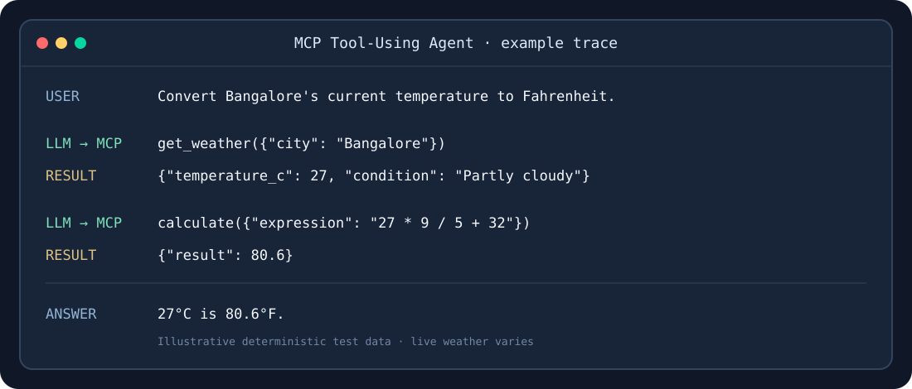
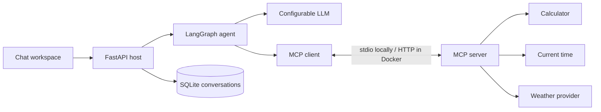

# ToolMesh

ToolMesh is an AI agent with a multi-conversation chat workspace. It discovers MCP tools at runtime, calls them through an MCP client, and uses their results in a bounded LangGraph workflow. Conversations and tool traces are saved in SQLite.



## What this demonstrates

- One MCP server exposes calculator, current-time, and weather tools with generated JSON Schemas and structured results.
- An MCP client discovers those schemas, validates arguments, and invokes only advertised tools.
- A LangGraph agent lets the LLM choose tools, use more than one tool, and answer from returned results.
- A FastAPI host, Docker Compose setup, deterministic tests, and CI make the example runnable and reviewable.
- A responsive chat workspace supports multiple saved conversations, search, rename, delete, tool trace inspection, and a dark theme.
- A deterministic offline demo mode lets reviewers try calculator, time, and weather tool flows without an LLM token.

MCP gives the host a standard way to discover capabilities. The host contains the MCP client and agent; the server owns tool implementations. Adding a server tool does not require adding its Python function to the agent.



## Quick start

Requires Python 3.12 or newer. The default LLM provider is Hugging Face Inference Providers. Set `HF_TOKEN` to ask open-ended questions. To try the portfolio demo without a token, set `LLM_PROVIDER=demo`; demo mode responds to the example prompts and uses real MCP tools.

```bash
python3 -m venv .venv
.venv/bin/python -m pip install -e '.[dev]'
cp .env.example .env
# Edit .env: set HF_TOKEN, or set LLM_PROVIDER=demo for an offline LLM demo.
set -a; source .env; set +a
.venv/bin/python -m uvicorn app.main:app --reload
```

Open `http://127.0.0.1:8000` to use the chat workspace. Create separate conversations with **New conversation**, reopen them from the sidebar, search by title, and rename or delete them from the conversation menu. Messages and tool traces are stored in `data/chat.db`. The last opened conversation and theme are remembered in the browser.

In another terminal, the API is also available:

```bash
curl http://127.0.0.1:8000/health
curl http://127.0.0.1:8000/tools
curl -X POST http://127.0.0.1:8000/chat \
  -H 'Content-Type: application/json' \
  -d '{"question":"What is 125 multiplied by 24?"}'
```

Interactive API documentation is at `http://127.0.0.1:8000/docs`. To exercise MCP without an LLM, run `.venv/bin/python -m app.client '24 * 3'`. This starts a stdio server subprocess, discovers the `calculate` schema, invokes it, and prints a structured result containing `72`. Run `.venv/bin/python -m mcp_server.server` to start the server directly; it waits for MCP messages on stdin.

The conversation API includes `GET/POST /api/sessions`, `GET/PATCH/DELETE /api/sessions/{id}`, and `POST /api/sessions/{id}/messages`. The latter sends the latest conversation history to the agent and saves the question, answer, and MCP tool trace. `GET /api/status` reports the configured provider. The original stateless `/chat` endpoint remains available.

## Tools and schemas

| MCP tool | Required input | Structured output | Validation |
| --- | --- | --- | --- |
| `calculate` | `expression: string` | `expression`, `result` | Only literals, parentheses, unary signs, `+`, `-`, `*`, `/`; bounded length, syntax tree, and magnitude. |
| `get_current_time` | `timezone: string` | `timezone`, ISO `datetime`, `formatted` | Requires an IANA timezone such as `Asia/Kolkata`. |
| `get_weather` | `city: string` | `city`, `temperature_c`, `condition`, `observed_at`, `source` | City lookup and provider failures produce controlled tool errors. |

Weather uses [Open-Meteo geocoding](https://open-meteo.com/en/docs/geocoding-api) and [current weather](https://open-meteo.com/en/docs). It has a five-second timeout per HTTP request and a replaceable provider interface. `Bangalore` resolves to `Bengaluru, India`; for other ambiguous names, include the country. The server also exposes a synthetic static resource at `company://policies/support` to show how MCP resources differ from callable tools.

## Example workflows

The agent receives the tool descriptions and schemas returned by `tools/list`. It may answer without a tool or issue one or more tool calls. A multi-step request can proceed as follows:

```text
User: Get the current temperature in Bangalore and convert it to Fahrenheit.
LLM -> get_weather({"city":"Bangalore"})
MCP -> {"temperature_c":27,...}
LLM -> calculate({"expression":"27 * 9 / 5 + 32"})
MCP -> {"result":80.6,...}
LLM -> final answer
```

The numbers above are a deterministic test example, not a live forecast. Other covered paths are a calculator question, a timezone question, a no-tool MCP explanation, invalid arguments, and a failing weather provider. `/chat` returns an `answer`, `request_id`, and a `tool_calls` trace with arguments, results or errors, and durations.

## Configuration

Copy `.env.example` to `.env` for local use. `.env` is ignored by Git. Environment variables are read at startup or request time; the API does not automatically parse `.env` outside Docker Compose.

| Variable | Default | Purpose |
| --- | --- | --- |
| `LLM_PROVIDER` | `huggingface` | `huggingface`, `openai`, `local`, or `demo`. |
| `LLM_MODEL` | Provider default | HF: `openai/gpt-oss-120b:fastest`; OpenAI: `gpt-4.1-mini`; required for local. |
| `HF_TOKEN` | unset | Required for Hugging Face chat. |
| `OPENAI_API_KEY` | unset | Required for OpenAI chat. |
| `LLM_BASE_URL` | unset | Required for an OpenAI-compatible local server. |
| `MCP_SERVER_URL` | unset | If unset, launch the MCP server as a stdio subprocess; Docker sets the server URL. |
| `DATABASE_PATH` | `data/chat.db` | SQLite file for conversations and messages. |
| `AGENT_PORT` | `8000` | Published host port in Docker Compose. |
| `LOG_LEVEL` | `INFO` | Application logging level. |

Hugging Face uses its [OpenAI-compatible router](https://huggingface.co/docs/inference-providers/en/guides/function-calling) through `ChatOpenAI`. Set `LLM_PROVIDER=openai` and `OPENAI_API_KEY` for OpenAI. For a local compatible server, set `LLM_PROVIDER=local`, `LLM_MODEL`, and `LLM_BASE_URL`. Model and provider availability can change; choose a model/provider that supports tool calls.

`demo` is a scripted model substitute for portfolio review, clearly labeled in the UI. It covers the suggested calculator, time, MCP explanation, and weather examples. Live weather still comes from Open-Meteo, so that example needs network access. General questions need a configured LLM provider.

## Docker

```bash
cp .env.example .env
# Set HF_TOKEN in .env, or use LLM_PROVIDER=demo.
docker compose up --build
```

Compose runs the host and one MCP server as separate services. The workspace is at `http://127.0.0.1:8000`; set `AGENT_PORT=18000` in `.env` if 8000 is occupied. The server uses Streamable HTTP internally, while the local client demo uses stdio. Chat data lives in the `chat-data` Docker volume and survives `docker compose down`. Stop with `docker compose down`; `docker compose down -v` also removes saved conversations.

## Tests and observability

```bash
.venv/bin/python -m pytest -q
```

Tests cover stdio startup and discovery, all three tool contracts, safe arithmetic rejection, weather provider responses and failures, MCP client validation and connection failure, no-tool and multi-step agent paths, configuration, conversation persistence, demo mode, and the served page and HTTP APIs. External model calls are replaced by a scripted fake; weather HTTP calls are mocked. GitHub Actions runs the suite on Python 3.12 and 3.13.

Agent logs use JSON records for `request_id`, step, tool name, arguments, duration, result or error, and final response. Credentials are read from environment variables and are never included in those records.

## Security and design decisions

- The calculator parses an AST and evaluates only permitted arithmetic nodes. It never calls `eval`, Python functions, shell commands, or arbitrary server tools.
- The MCP client validates arguments against discovered JSON Schema and refuses tool names the server did not advertise.
- Tool calls, model steps, execution time, and total agent runtime are bounded. Failures are returned as controlled MCP or API errors.
- FastAPI does not import or call individual tool implementations. The weather provider is isolated so it can be replaced.
- The synthetic resource contains no private data. `.env`, the local SQLite database, and virtual environments are excluded from source control.

## Limitations and future improvements

Live LLM behavior depends on a configured token and a model/provider that supports function calling; CI does not make paid model calls. Weather requires Open-Meteo availability and may need a country qualifier for ambiguous city names. Conversations are stored in one local SQLite database without user accounts, authentication, or production rate limiting; deploy behind appropriate access control if used outside a private demo.
